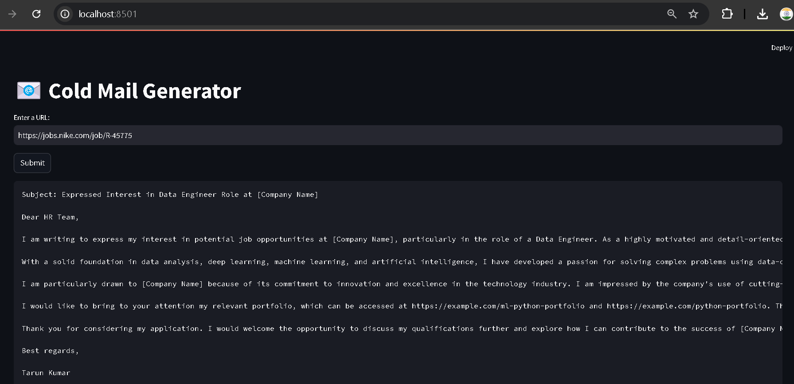
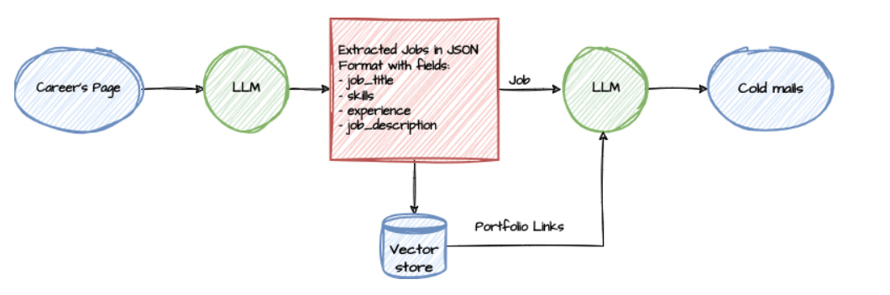

# 📨 Cold Mail Generator for Job Search
Cold email generator designed to help job seekers efficiently craft personalized cold emails to HRs of various companies. This tool leverages LangChain and Streamlit to generate tailored cold emails for job applications, saving time and improving the chances of getting noticed by potential employers.

**Imagine a scenario:**

- You are seeking a job as a Data Scientist, Software Engineer, or Business Analyst.
- This tool helps you generate a professional cold email by extracting job descriptions from company career pages and tailoring your email with relevant details about your skills and experience.



## Features
- **Personalized Emails:** Generates cold emails customized for specific job roles and companies.
- **Job Description Integration:** Extracts job listings directly from the careers pages of companies.
- **Relevant Links:** Incorporates links to your CV, portfolio, or other relevant work, dynamically sourced based on the job description.
- **Streamlined Workflow:** Simplifies the process of reaching out to HRs with impactful and professional emails.

## Architecture Diagram


## Set-up
1. **Obtain an API Key:**
   - Get an API_KEY from https://console.groq.com/keys.
   - Inside `app/.env`, update the value of `GROQ_API_KEY` with the API_KEY you created.

2. **Install Dependencies:**
   ```commandline
   pip install -r requirements.txt
   ```

3. **Run the Application:**
   ```commandline
   streamlit run app/main.py
   ```

## Example Use Case
1. Input the URL of a company's careers page.
2. Select a job listing from the extracted descriptions.
3. Provide your details (name, degree, skills, etc.).
4. Generate a cold email tailored to the job description and company.

---

Copyright (C) Tarun Kumar All rights reserved.

